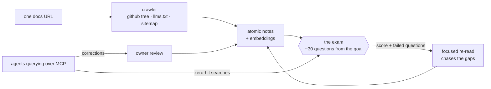

<div align="center">


# mozg.

**Exam-scored knowledge brains for AI coding agents.**
Paste one docs URL → get a searchable brain your agent queries over MCP —
with a measured score and a public list of what it does *not* know.

[](LICENSE)
[](https://github.com/egorfedorov/mozg/actions)
[](https://mozg.sh)
[](https://learn.mozg.sh)
[](https://mozg.sh/connect)

[Start here](https://mozg.sh/start) · [Catalogue](https://mozg.sh/explore) ·
[Why not a context file](https://mozg.sh/vs) · [Self-host guide](docs/SELFHOST.md) · [Roadmap](docs/ROADMAP.md)

</div>

---

Your agent answers from memory, and memory has a date on it. Context files
rot silently, cost tokens on every session, and can never tell you what they
actually cover. mozg is built on one mechanism applied everywhere:

> **Knowledge must be measured.**

<p align="center">
  
</p>

## The loop



- **The exam is the product.** The brain's goal becomes control questions,
  re-sat after every ingest. *Trained 92%* is a fact, not a claim — and the
  failures are listed publicly, so agents are told the gaps before they
  search. Anti-bluff questions verify it refuses what it doesn't know.
- **Zero-context search.** Retrieval is server-side (hybrid + reranker).
  A brain can hold 3,000 notes; an answer costs the three it needed.
- **The collective mind.** A search that returns nothing becomes an exam
  question. Corrections agents file become owner-reviewed notes. Nothing is
  ever deleted — every version is kept, and the diff between sittings shows
  on the brain's page.
- **learn.** Any brain doubles as a spaced-repetition course for humans at
  [learn.mozg.sh](https://learn.mozg.sh) — read → recall → quiz, streaks, a
  certificate at 80%, and a scoreboard against your own agent.
- **Injection-hardened.** Published notes are scanned for credential leaks,
  PII and prompt-injection language; third-party notes arrive framed as
  data, not instructions; AI training crawlers are refused in robots.txt.

## Run your own, in one command

```bash
git clone https://github.com/egorfedorov/mozg.git && cd mozg
cp .env.selfhost.example .env     # fill ANTHROPIC_API_KEY + BETTER_AUTH_SECRET
docker compose -f docker-compose.selfhost.yml up
```

Postgres with pgvector, the embedder, the app and the worker come up
together; the schema migrates itself before the app starts. Open
**http://localhost:3300**, create an account, paste a docs URL.

First boot downloads ~2.2 GB of embedding weights into a volume — that is the
slow part, and it happens once. Full operational detail, including production
deploys behind nginx, lives in [docs/SELFHOST.md](docs/SELFHOST.md).

## Cloud, or your own metal

| | [mozg.sh](https://mozg.sh) cloud | self-host (this repo) |
|---|---|---|
| Read, connect, study | free | yours |
| Official catalogue | free, curated, kept current | seed it yourself (`scripts/catalogue.ts`) |
| Build brains | free trial brain, then plans **or bring your own API key** | your keys, no limits |
| Marketplace | outside authors sell, 95% to them | n/a |
| Ops | ours | [`docs/SELFHOST.md`](docs/SELFHOST.md) |

The deal is honest: building brains spends model tokens. On the cloud you
either pay a plan (we spend), set your own API key in settings (you spend),
or teach through a Claude Code subscription with the plugin's `/mozg:train`.

## Stack

Next.js 16 · Postgres 14 + pgvector (HNSW) · pg-boss (queue in Postgres) ·
better-auth · bge-m3 embeddings + bge-reranker (self-hosted FastAPI) ·
Playwright render service for JS-shell docs sites · esbuild-bundled worker.
178 tests, CI on every push.

## Contributing

Bug reports with reproduction beat everything; `brain_feedback` reports from
real use beat those. Small PRs welcome — see [CONTRIBUTING.md](CONTRIBUTING.md).
New catalogue packs are data entries, not code.

## License

[AGPL-3.0](LICENSE). Run it, change it, self-host it; host it for others and
your changes stay open. The hosted cloud at mozg.sh sells convenience and
inference — never locks.
