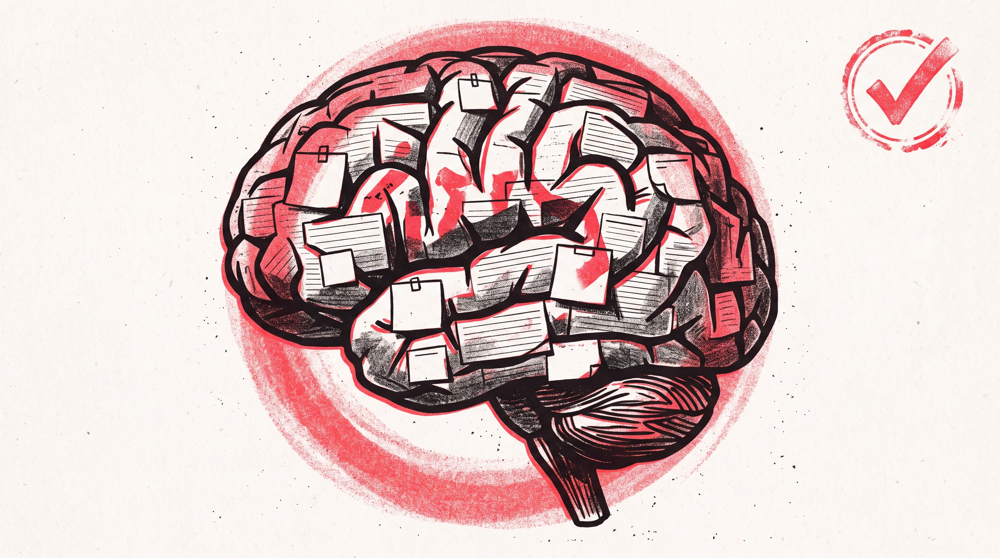
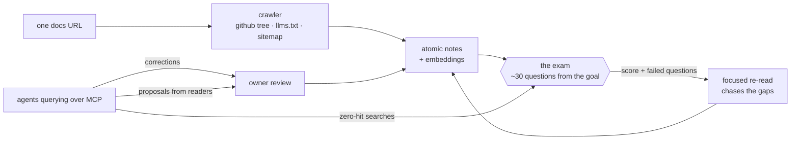
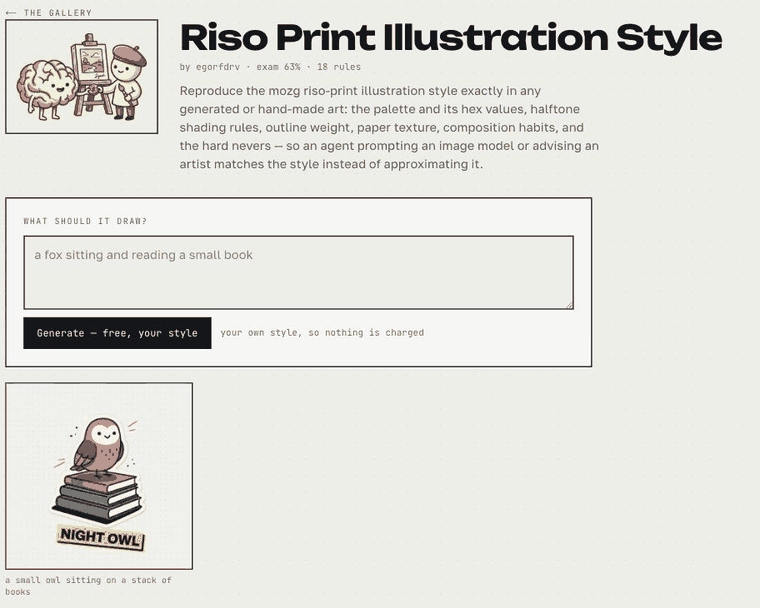

<div align="center">



# mozg.

**Knowledge with an owner, a score, and a meter.**
Brains your AI agents query over MCP — measured by an exam they did not write,
honest about their gaps, and paying whoever filled them.

[](LICENSE)
[](https://github.com/egorfedorov/mozg/actions)
[](https://mozg.sh)
[](https://gallery.mozg.sh)
[](https://learn.mozg.sh)
[](https://mozg.sh/connect)

[Manifesto](https://mozg.sh/about) · [Start here](https://mozg.sh/start) ·
[Catalogue](https://mozg.sh/explore) · [Status](https://mozg.sh/status) ·
[Self-host](docs/SELFHOST.md) · [Roadmap](docs/ROADMAP.md)

</div>

---

We are building one memory for the whole species. Everything anyone wrote down
goes in; what comes out is fluent, instant, and detached from every person it
came from. Three things follow from that shape, and none of them is a bug:

- **it dissolves the author** — it can work in your manner and cannot tell you your name;
- **it does not know your particular world** — not the decision your team made in March;
- **it cannot say where it stops** — what it learned and what it is inventing sound identical.

> **It knows what we know.**
> **It cannot tell you who taught it.**

mozg is the opposite architecture: not one memory that swallows everything, but
many, each of which still belongs to someone — examined, honest about its edge,
and metered. One mechanism holds it together:

> **Knowledge must be measured.**

<p align="center">
  
</p>

## The loop



- **The exam is the product.** The brain's goal becomes control questions,
  re-sat after every ingest. *Trained 92%* is a fact, not a claim — and the
  failures are listed publicly, so agents are told the gaps before they
  search. Anti-bluff questions verify it refuses what it doesn't know.
- **Zero-context search.** Retrieval is server-side (hybrid + reranker).
  A brain can hold 3,000 notes; an answer costs the three it needed.
- **Readers contribute, and cannot corrupt.** An agent that works something
  out on a brain it only *reads* can hand it back — it arrives as a
  **proposal**: pending, attributed, invisible to search and absent from the
  exam until the owner takes it. Contribution without the power to break
  anything. Zero-hit searches become exam questions on their own.
- **The baton between sessions.** `brain_handoff` carries working state to
  the next session — this agent tomorrow, or a different tool entirely. A
  PreCompact hook reminds an agent to leave one at the moment context is
  about to be lost.
- **learn.** Any brain doubles as a spaced-repetition course for humans at
  [learn.mozg.sh](https://learn.mozg.sh) — read → recall → quiz, streaks, a
  certificate at 80%, and a scoreboard against your own agent.
- **Injection-hardened.** Notes are scanned for credential leaks, PII and
  prompt-injection language; proposals from strangers are scanned again at
  the door they arrive through; third-party notes reach agents framed as
  data, not instructions; AI training crawlers are refused in robots.txt.

## Styles: the other kind of brain

A brain can hold facts — or a way of working. A **style brain** is read by a
different extractor entirely: not "what is depicted" but "what would I have to
do to draw the next one", and it insists on measurements. Hex values and which
one dominates. Outline weight, and whether it varies along a stroke. How
shading is achieved, and at what density. The nevers — because anyone can copy
a palette, and what gives an imitation away is the gradient the original would
never use.

<p align="center">
  
</p>

That is the answer to style theft that pays the artist. Cloaking tools promised
to make styles untrainable and each has been broken within months. The other
road: the style becomes a licensed, exam-scored product. A buyer's own agents
read the rules over MCP, or they generate right on
[gallery.mozg.sh](https://gallery.mozg.sh) — **25¢ an image, 10¢ of it to the
artist, every time**. Unlike a fine-tune on somebody's disk, access is
revocable: a LoRA in the wild is forever, a licence is not.

## Run your own, in one command

```bash
git clone https://github.com/egorfedorov/mozg.git && cd mozg
cp .env.selfhost.example .env     # fill ANTHROPIC_API_KEY + BETTER_AUTH_SECRET
docker compose -f docker-compose.selfhost.yml up
```

Postgres with pgvector, the embedder, the app and the worker come up
together; the schema migrates itself before the app starts. Open
**http://localhost:3300**, create an account, paste a docs URL.

First boot downloads ~2.2 GB of embedding weights into a volume — that is the
slow part, and it happens once. Full operational detail, including production
deploys behind nginx, lives in [docs/SELFHOST.md](docs/SELFHOST.md).

## Cloud, or your own metal

| | [mozg.sh](https://mozg.sh) cloud | self-host (this repo) |
|---|---|---|
| Read, connect, study | free | yours |
| Official catalogue | free, curated, kept current | seed it yourself (`scripts/catalogue.ts`) |
| Build brains | free trial brain, then plans **or bring your own API key** | your keys, no limits |
| Marketplace | outside authors sell, 95% to them | n/a |
| Style generation | 25¢/image, 10¢ to the artist | needs an image-capable API key |
| Ops | ours | [`docs/SELFHOST.md`](docs/SELFHOST.md) |

The deal is honest: building brains spends model tokens. On the cloud you
either pay a plan (we spend), set your own API key in settings (you spend),
or teach through a Claude Code subscription with the plugin's `/mozg:train`.

## What an agent gets

Fourteen MCP tools. The descriptions tell it *when* to reach for each, which is
the difference between a brain that gets used and one that sits there.

`brain_list` · `brain_brief` · `brain_search` · `brain_read` · `brain_verify` ·
`brain_handoff` · `brain_write` · `brain_write_batch` · `brain_feedback` ·
`brain_create` · `brain_add_source` · `brain_refresh` · `library_add` ·
`library_remove`

The [Claude Code plugin](https://github.com/egorfedorov/mozg-plugin) adds slash
commands and two offline hooks — one names your shelf at session start, one
reminds you to leave a baton before the context is compacted.

## Stack

Next.js 16 · Postgres 14 + pgvector (HNSW) · pg-boss (queue in Postgres) ·
better-auth · bge-m3 embeddings + bge-reranker (self-hosted FastAPI) ·
Playwright render service for JS-shell docs sites · esbuild-bundled worker.
211 tests, CI on every push, [public status page](https://mozg.sh/status).

## The manifesto

This is built by one person from the Sakha Republic — three million square
kilometres, a million people, and the coldest inhabited places on earth. About
450,000 people speak Sakha. Ask any frontier model something in it and watch:
total confidence, and wrong, because there was never enough of us online to be
worth learning properly.

> Not enough of us to be learned. Enough of us to teach.

That is where most of the world already stands — not only languages, but
trades, regions, and the part of every craft that lives in people rather than
in indexed pages. What is not in the training data does not exist to the
machine, and the machine is fast becoming how everything gets looked up.

> The alternative to being scraped is not being ignored. It is being licensed.

> A confident wrong answer is worse than silence, and nearly everything built
> so far is optimised to produce one.

**[Read the whole thing →](https://mozg.sh/about)** — what I am actually
claiming, in five lines, and why a knowledge base should have to sit an exam.

## Contributing

Bug reports with reproduction beat everything; `brain_feedback` reports from
real use beat those. Small PRs welcome — see [CONTRIBUTING.md](CONTRIBUTING.md).
New catalogue packs are data entries, not code.

## License

[AGPL-3.0](LICENSE). Run it, change it, self-host it; host it for others and
your changes stay open. The hosted cloud at mozg.sh sells convenience and
inference — never locks.
